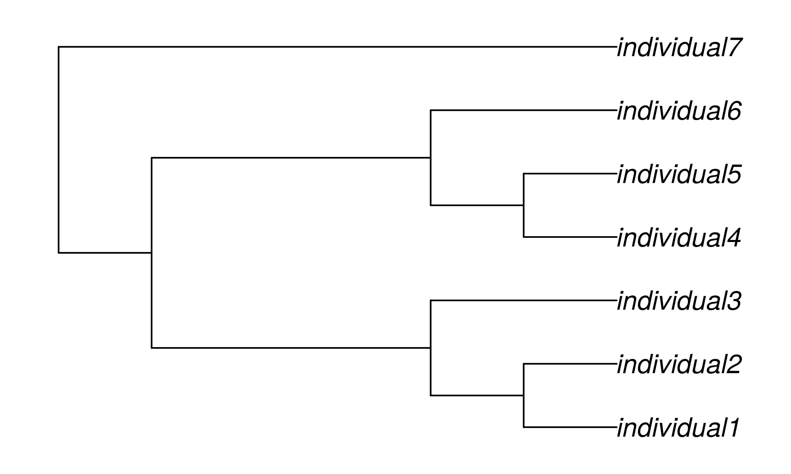

<!-- adding bold and italic options -->

## Research projects: Phylogenetics

- Population trees
- Bayesian Phylogenetics
- Molecular dating

--- .class #id

## Suggested reading

<embed src="./assets/img/Baldauf - 2003 - Phylogeny for the faint of heart A tutorial.pdf" title="plot of chunk unnamed-chunk-1" alt="plot of chunk unnamed-chunk-1" width="100%" height="500" type="application/pdf" />

--- .class #id

## Suggested reading

<embed src="./assets/img/Villanea, Kitchen, Kemp - 2019 - Applications of bayesian skyline plots and approximate bayesian computation for human demography.pdf" title="plot of chunk unnamed-chunk-2" alt="plot of chunk unnamed-chunk-2" width="100%" height="500" type="application/pdf" />

--- .class #id

## Suggested reading (Viral)

<embed src="./assets/img/Dudas et al. - 2018 - MERS-CoV spillover at the camel-human interface.pdf" title="plot of chunk unnamed-chunk-3" alt="plot of chunk unnamed-chunk-3" width="100%" height="500" type="application/pdf" />

--- .class #id

## Suggested reading (mtDNA)

<embed src="./assets/img/Fortes - 2016 - Ancient DNA reveals differences in behaviour and sociality between brown bears and extinct cave bears(2).pdf" title="plot of chunk unnamed-chunk-4" alt="plot of chunk unnamed-chunk-4" width="100%" height="500" type="application/pdf" />

--- .segue .dark 

## Population trees

--- .class bg:white

## Species trees

- These are phylogenies of species
- Each tip is a different, reproductively isolated species
- Can be inferred from a variety of data types

--- .class bg:white

## Gene trees

- These are phylogenies of individual loci (e.g. a gene)
- Or related sets of loci (e.g. multigene families)
- Each tip is a different allele (i.e. a gene variant)

--- .class bg:white

## Population-level trees

- Each tip is an individual
- Each node is their most recent ancestor (coalescence event)
- Shows the relationships of individuals and populations

--- .segue .dark 

## How does that work?

--- .class bg:white

--- .class bg:white

## Calculating population-level trees

### We'll think about mitochondrial haplotypes (diploid loci 2x more complex)

- Sequence variation provides phylogenetic information
- Similar sequences are more closely related
- Branch lengths are (loosely) proportional to sequence divergence
- Coalescence times also depend on population size
- Described by **coalescent theory**

--- &twocol

## Examples: Dispersal of Barbados anoles

*** =right

*** =left

*Anolis roquet, Adamhesim, CC BY 4.0*

*Anolis extremus, Postdlf, CC BY SA-3.0*

--- &twocol bg:white

## Examples: Barbados anoles

*** =right

*** =left

*Thorpe et al. Mol phylogenet evol 127 (2018): 682-695.*

--- .class bg:white

## Examples: viral outbreaks, Ebola virus in West Africa

*Suchard, et al. Virus evolution 4.1 (2018): vey016.*

--- .segue .dark 

## Bayesian phylogenetics

--- &vcenter

## Introductory video 1

https://www.youtube.com/watch?v=IqMzYTOf6H0&ab_channel=DataCamp

--- &vcenter

## Introductory video 2

https://www.youtube.com/watch?v=FmzgKXV53-w&ab_channel=DataCamp

--- .class #id

## The key points

- Bayesian statistics provide a way of describing our prior knowledge of a system as a probability
- We can then update this `prior probability` by observing some data
- The updated probability is called the `posterior probability`
- Prior and posterior probabilities can also take the form of `probability distributions`
- These allow us to describe a range of probabilites for different values
- More flexible than a single fixed probability value

--- &twocol bg:white

## Probability distributions

- Imagine you want to predict the number of patients arriving at a hospital in the next week
- You have information from previous weeks that allow you to make an estimate
- **But on the Monday...**

*** =left

--- &twocol bg:white

## Probability distributions

- Imagine you want to predict the number of patients arriving at a hospital in the next week
- You have information from previous weeks that allow you to make an estimate
- **But on the Monday, more patients arrive that you were expecting!**

*** =left

*** =right

--- .class #id

## How does this work with phylogenetics?

- The phylogeny is the evolutionary history of the sequences
- We need a `model` of how the sequences evolve
- The model has `parameters` that we can assign prior probabilites to
- The tree `topology`, for example, is a parameter
- We can then observe some data, in the form of a `sequence alignment`
- And calculate the `posterior probabilities` of our model parameters

--- .class #id

## An example phylogenetic model

Parameter|Prior
---------|------
Substitution rate|estimated rate
Tr/Tv ratio|estimated ratio
Base frequencies|estimated frequencies A,T,G,C
Topology|A set of tree topologies
Branch lengths|A set of branch lengths
Population size|A number of individuals

--- .segue .dark 

## Can you compute all those possibilities?

--- .class #id

## Can you compute all those possibilities?

### Example: tree topology

- We would like to calculate posterior probabilities for all possible tree topologies
- Then select the ones with highest probability

>- How many rooted tree topologies are there?
  + 3 sequences = 3 trees
  + 4 sequences = 15 trees
  + 5 sequences = 105 trees
  + 10 sequences = 34,459,425 trees
  + 53 sequences = 2.7E+80 (> total atoms in universe)

>- **Computing all possible topologies for modest number of sequences is computationally impossible**

--- &twocol

## Markov chain Monte Carlo (MCMC) sampling

*** =left

1. Start at a tree
2. Jump to a nearby tree
3. Compare posterior probabilities
4. New tree > previous tree
  + accept
5. New tree < previous tree
  + accept proportional to difference
6. Repeat (x millions)

*** =right

--- .class #id

## MCMC sampling in practise

>- The initial moves are likely to have low probability
>- This is called `burn in`
>- We rapidly move to a set of parameter values with similarly high probability
>- This is called `convergence` or `stationarity`
>- Sampling the chain at convergence approximates the true posterior distribution
>- This is called the `posterior sample`
>- Since the MCMC steps are not independent, we take 1,000s between every sample
>- And we can verify sufficient sampling using the `effective sample size`

--- &twocol bg:white

## MCMC sampling in practise

Graphically it looks like this

*** =left

*** =right

--- .segue .dark 

## But aren't we also collecting thousands of trees?

--- &twocol bg:white

## Summarising thousands of trees

*** =right

- The *actual* result of the analysis is thousands of trees
- The posterior sample of trees
- Typically pick one good one, and annotate with clade posterior probabilities
- Other parameters like branch lengths are averaged across posterior sample

*** =left

--- .segue .dark 

## Molecular dating

--- &vcenter

## Branch length are typically scaled to genetic distance

--- &vcenter

## Imagine if they could be scaled to time

--- .class bg:white

## Molecular clock hypothesis

- Substitutions seem to occur at an approximately constant rate
- This means genetic distance is proportional to time
- Sometimes the relationship breaks down (divergent lineages, saturation, selection)
- At the population level it generally works well

--- .class #id

## Methods of calibrating the tree

- If we assume a molecular clock, we can use external sources of information to calibrate the tree
- **Genetic distance per unit time**

### There are 3 parameters of interest:

- `tip ages`
- `node ages`
- `substitution rate`

--- .class #id

## The three parameters are interdependent

- Imagine 3 sequences, sampled at different timepoints
- Genetic distances: A-> B = 0.01; A -> C = 0.015; B -> C = 0.02

>- Substitution rate = 0.02 / 2000 = 1E-05 substitutions per year
>- Coalescence time B -> C = 0.02 * 1E-05 = 2000 
>- Age A = (0.02 - 0.15) * 1E-05 = 500

--- .class #id

## We can assign priors on all 3

- **Tip dates**: sampling dates, radiocarbon ages, or unknown
- **Coalescence times**: population divergence times, fossils, or unknown
- **Substitution rate**: previous estimates, related species, or unknown

### Within a Bayesian analysis, as long as we have prior information of some of these, we can calculate posterior probabilities of all parameters

--- .class #id

## Example: cave bears

- Radiocarbon dates, estimate sub rate and coalescence times

--- .class #id

## Example: brown bears

- Radiocarbon dates, estimate substitution rate, coalescence times, and an unknown age

--- .class #id

## Example: giant pandas

- Radiocarbon dates and root node age, estimate sub rate, other coalescence times

--- .class #id

## Research projects: Phylogenetics

- Population trees
- Bayesian Phylogenetics
- Molecular dating

--- &thankyou

## Next time

**Your turn**

